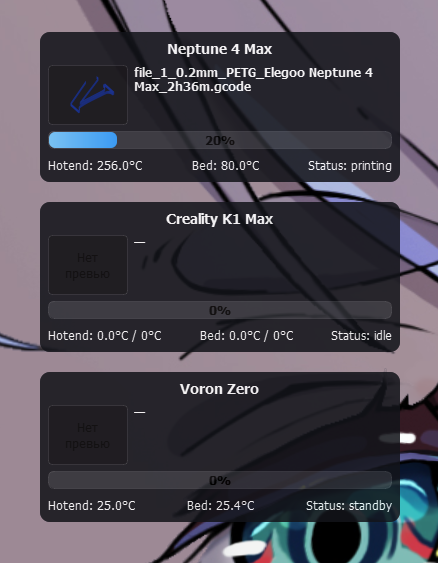

# KlipperDesk

Мини-виджет для рабочего стола, позволяющий отслеживать процесс 3D-печати на принтерах с Klipper. Лёгкий, прозрачный, всегда поверх окон — отличный помощник, когда хочется видеть статус печати одним взглядом.



## 🚀 Особенности

Всегда поверх всех окон — виджет не потеряется среди приложений.

Несколько принтеров — просто укажите IP, и виджет подключится сам.

Обновления в реальном времени через WebSocket.

Предпросмотр текущей модели

Температуры, прогресс и основные метрики под рукой.

Минималистичный дизайн — ничего лишнего.

Регулируемая прозрачность для аккуратного размещения на рабочем столе.

## 🧭 Планы на будущее

График температур и прогресса

Мини-кнопки (паузa, стоп, управление)

Расширенные настройки виджетов

Уведомления

Дополнительные темы оформления

…и ещё пара приятных сюрпризов

## 📦 Установка

#### Скомпилированный exe файл: https://github.com/OrkaLxrd/KlipperDesk/releases/download/release/KlipperDesk.exe

## 📦 Или же вы можете запустить исходник:

#### Установите Python 3.8 или выше с [официального сайта](https://python.org/)

#### Клонируйте репозиторий (Или скачайте его)
```
git clone https://github.com/OrkaLxrd/KlipperDesk.git
cd KlipperDesk
```

#### Установите зависимости
`pip install -r requirements.txt`

#### Запуск
`python KlipperDesk.py`

Жду обратной связи!

## 🙌 Благодарности

### Этот проект вдохновлён и построен на плечах гигантов из сообщества Klipper:

[Klipper](https://github.com/Klipper3d/klipper)
 — высокопроизводительная прошивка для 3D-принтеров, созданная Kevin O'Connor.

[Moonraker](https://github.com/Arksine/moonraker)
 — API-сервер для Klipper, разработанный Arksine.
